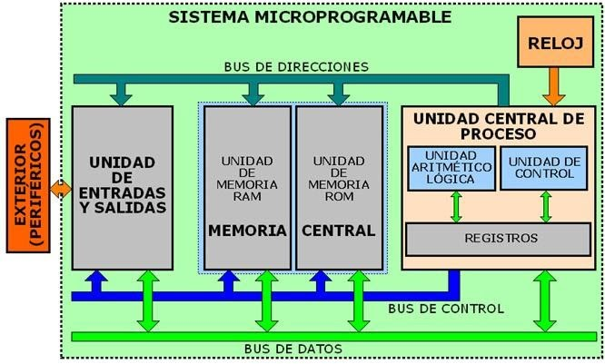

# NOTAS SOBRE LENGUAJE ALTO NIVEL Y LENGUAJE MÁQUINA

En este repositorio, tenemos un programa escrito en C y otro en Python que calculan los numeros de la serie de Fibonacci, y un conversor del binario que escribe el compilador gcc y el binario que escribe la librería de Python pyinstaller a código máquina.

Para entender las diferentes instrucción del código máquina se puede consultar el siguiente [enlace](<https://www.geeksforgeeks.org/machine-instructions/>). Para entender más en profundidad estos conceptos, se puede utilizar este [pdf](./x64_cheatsheet.pdf).

La forma de utilizar el código escrito en C de este repositorio es:

1. Compilar el programa en C usando:

```sh
make
```

2. Una vez compilados todos los ejecutables con diferentes niveles de optimización, se ejecuta el script ```c2machine.sh``` que crea los archivos .txt con el código en ensamblador utilizando la herramienta ```otool```.


Para compilar el código Python y obtener el binario se tiene que utilizar la librería ```pyinstaller```. Los pasos son:

1. Instalar la librería utilizando pip:

```sh
pip install pyinstaller
```

2. Ejecutar el siguiente comando para crear el archivo binario:

```sh
pyinstaller fib.py
```

3. Ejecutar el script ```py2machine.sh``` que crea el archivo .txt con el código máquina extraído del archivo binario que se encuentra en el directorio dist.


En la siguiente imagen aparece un gráfico de como está estrcturado un microprocesador, que es la unidad básica de computación que existe actualemtente

<p align="center">

</p>

El código en lenguaje máquina que se encuentra en los archivos .txt hace referencia a operaciones que se hacen dentro de la Unidad Central de Proceso (tanto en la ALU como en los registros), y como estos son transferidos a la memoria RAM del microprocesador.

Por ejemplo, el código fuente del programa en fib.c de Fibonacci con una compilación de -O0 sería:

```txt
fib:
(__TEXT,__text) section
_main:
0000000100003f50	pushq	%rbp
0000000100003f51	movq	%rsp, %rbp
0000000100003f54	subq	$0x10, %rsp
0000000100003f58	movl	$0x0, -0x4(%rbp)
0000000100003f5f	movl	$0x0, -0x8(%rbp)
0000000100003f66	movl	$0x1, -0xc(%rbp)
0000000100003f6d	movl	-0x8(%rbp), %esi
0000000100003f70	leaq	0x35(%rip), %rdi
0000000100003f77	movb	$0x0, %al
0000000100003f79	callq	0x100003fa6
0000000100003f7e	movl	-0x8(%rbp), %eax
0000000100003f81	addl	-0xc(%rbp), %eax
0000000100003f84	movl	%eax, -0x10(%rbp)
0000000100003f87	movl	-0xc(%rbp), %eax
0000000100003f8a	movl	%eax, -0x8(%rbp)
0000000100003f8d	movl	-0x10(%rbp), %eax
0000000100003f90	movl	%eax, -0xc(%rbp)
0000000100003f93	cmpl	$0xff, -0x8(%rbp)
0000000100003f9a	jl	0x100003f6d
0000000100003fa0	jmp	0x100003f5f
```

La primera columna hace referencia posiciones de memoria


*Para más información sobre como funciona este código consultar el siguiente [enlace](<https://www.youtube.com/watch?v=yOyaJXpAYZQ&list=LL&index=3&t=358s>)

** Más información sobre como pasar de código de alto nivel a código máquina en los siguientes vídeos: [Video 1](<https://www.youtube.com/watch?v=QXjU9qTsYCc&list=LL&index=2>) [Serie de videos](<https://www.youtube.com/playlist?list=PL8dPuuaLjXtNlUrzyH5r6jN9ulIgZBpdo>).